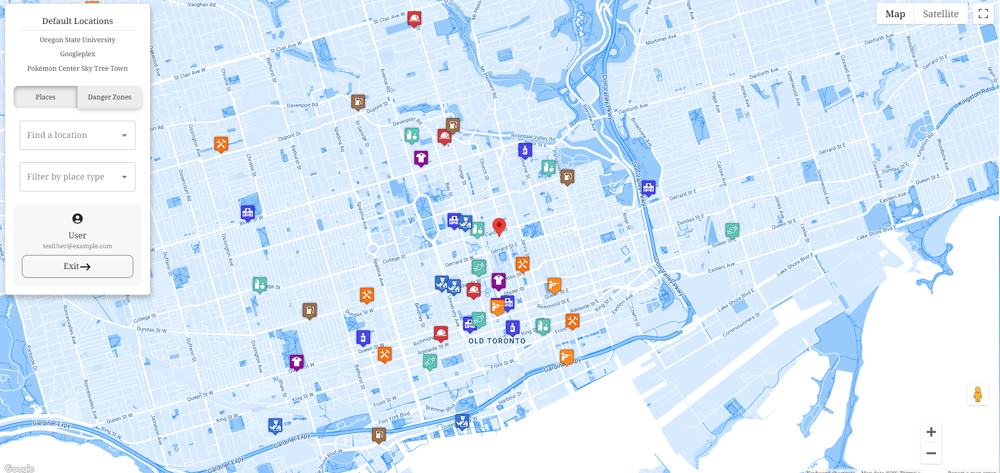
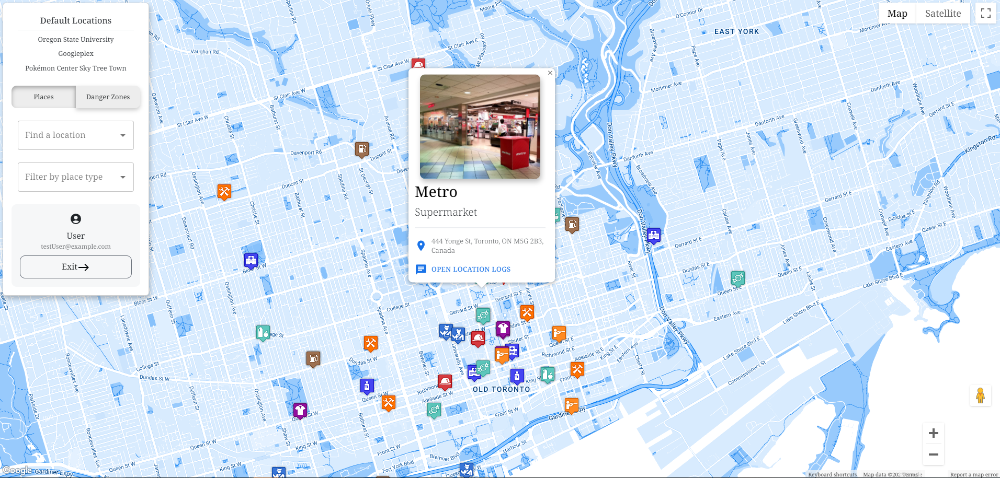
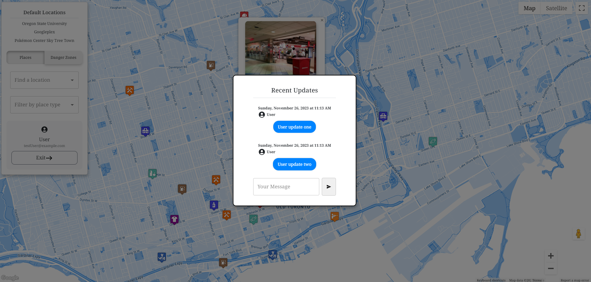
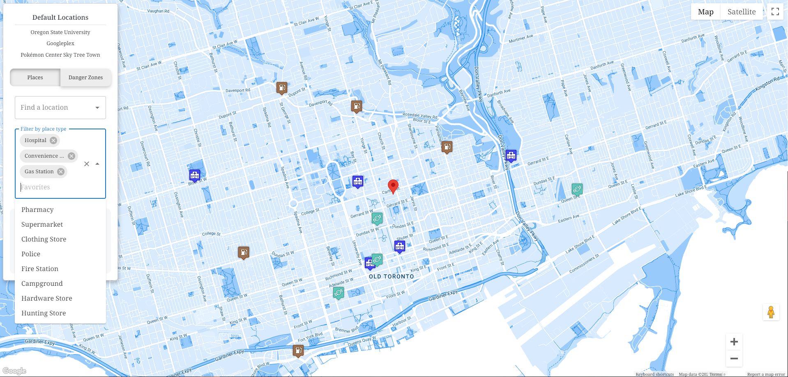

# Outbreak Navigator [Hackathon pitch](https://www.youtube.com/watch?v=o4-UrAI2y7U)

## Introduction

Outbreak Navigator is an interactive map web application designed to provide real-time updates and information about essential locations during crisis situations, like the COVID-19 pandemic. This project was inspired by the crowdsourcing nature of mapping apps like Waze, but with a twist on the importance of crowdsourcing during a crisis.

## Features

### Essential Survival Map

 - **Initial map state**: The initial map state is based on data filtered on the server from the Google Places API
 - **Places modal**: Each place contains a modal that reflects basic information about the place
 - **Crowdsourced user data**: A chat log appears with time stamped information from people at the location
 - **Client side filtering**: Users can filter the map further on the client

### Danger Zone Map

GeoJSON Data Utilization: Indicates high-risk areas due to population density.
Polygon Objects: Mark danger zones on the map.

## General Features

Default Locations: Includes places like the OSU campus, Googleplex offices, and major stores in Japan.
Drag and Drop: Functional map pins for easy navigation.
Autocomplete Feature: For searching any global address.

## Technology Stack

Frontend: React, Material UI, Bootstrap
Backend: Node.js, Express.js
APIs: Google Places, Google Maps, Google Geocode
Database: MySQL
Tools: Postman, Vite

Future Plans
The primary focus for future updates includes:

Reducing API costs by implementing caching.
Enhancing data handling for better production efficiency.
