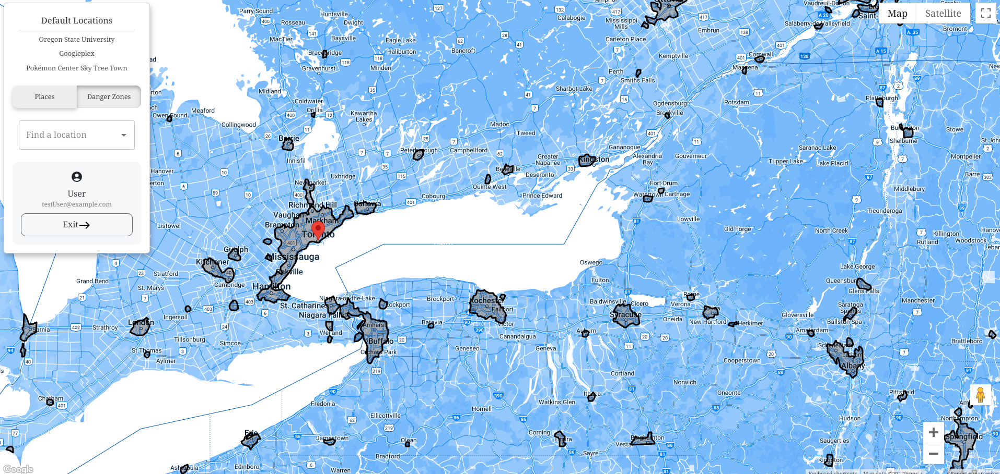
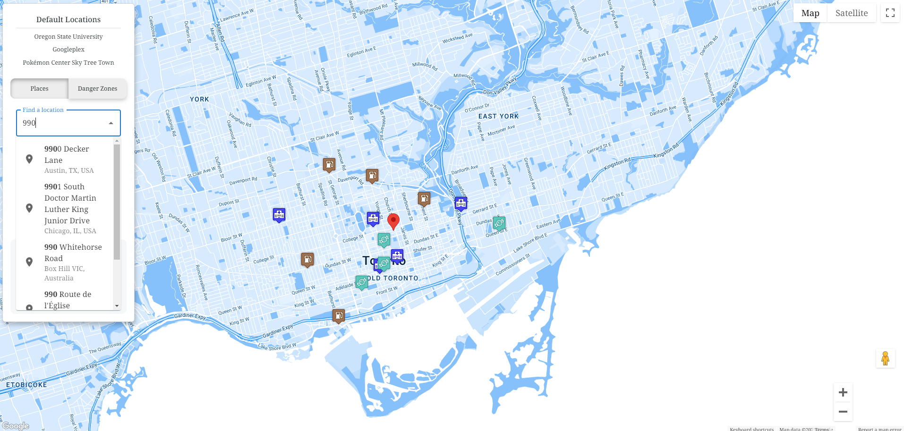

# Outbreak Navigator

[Hackathon pitch](https://www.youtube.com/watch?v=o4-UrAI2y7U)

## Introduction

Outbreak Navigator is an interactive map web application designed to provide real-time updates and information about essential locations during crisis situations, like the COVID-19 pandemic. This project was inspired by the crowdsourcing nature of mapping apps like Waze, but with a twist on the importance of crowdsourcing during a crisis.

## Features

### Essential Survival Map

#### Initial map state:

-   The initial map state is based on data filtered on the server from the Google Places API
    

#### Places modal:

-   Each place contains a modal that reflects basic information about the place
    

#### Crowdsourced user data:

-   A chat log appears with time stamped information from people at the location
    

#### Client side filtering:

-   Users can filter the map further on the client
    

### Danger Zone Map

#### GeoJSON Data Utilization

-   Populates the map with GeoJSON polygons based on worldwide population density data.
    

## General Features

-   **Autocomplete Feature**: For searching any global address.
    
-   **Default Locations**: Includes places like the OSU campus, Googleplex offices, and major stores in Japan.
-   **Drag and Drop**: Functional map pins for easy navigation.

## Technology Stack

-   **Frontend**: React, Material UI, Bootstrap
-   **Backend**: Node.js, Express.js
-   **APIs**: Google Places, Google Maps, Google Geocode
-   **Database**: MySQL
-   **Tools**: Postman, Vite

## Future Plans

1. Reducing API costs by implementing caching.
2. Enhancing data handling for better production efficiency.
